# Registro de prompts utilizados para el uso de la inteligencia artificial.

Durante el desarrollo del proyecto se utilizaron varias aplicaciones de inteligencia artificial para recibir guía y asistencia; además complementar conocimiento adquirido para implementar mejoras en la API y que su funcionamiento no se vea afectado al momento de realizar cambios en la lógica y modularización del código.

Las respuestas recibidas por la IA fueron analizadas y adaptadas según la necesidad de mejora para el proyecto

## Prompt:
Al probar en Thunder client todos los endpoints dentro de la ruta authors saltaba un error y no encontraba un autor por su ID por lo que pedí que revisara el código dentro de VS code y me indique la falla para solucionarlo

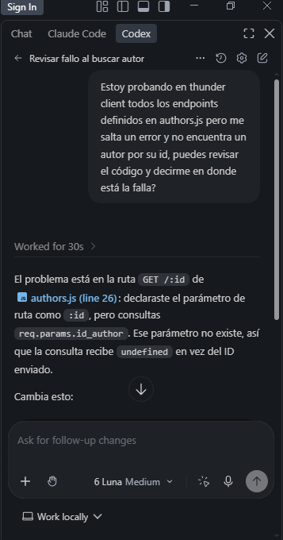
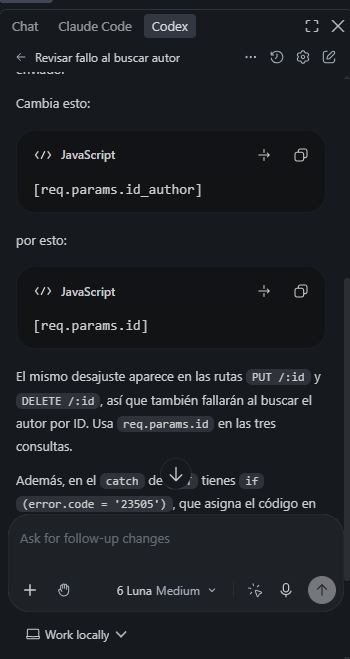
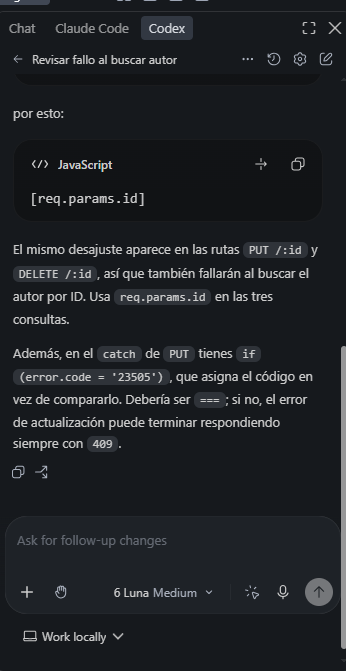

La respuesta de la IA ayudó a identificar el error y dió solución al problema.

## Prompt:
Cúal es la versión actual de OpenApi para documentar dentro de mi archivo YAML

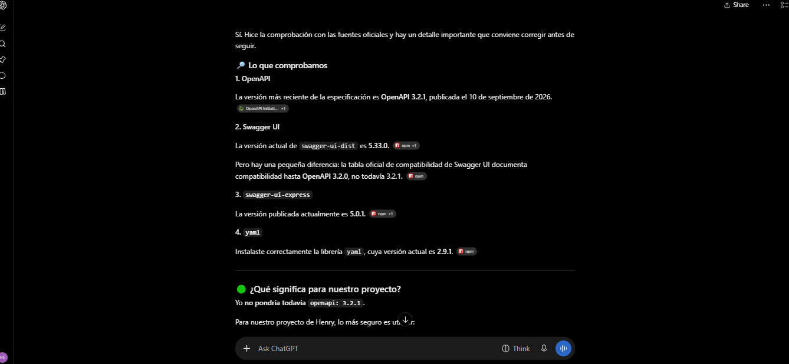

La respuesta de la IA ayudó a documentar la versión actual y funcional dentro de la documentación OpenApi/Swagger.

## Prompt:
Pedí a la IA una retroalimentación sobre la estructura actual de la documentación en OpenApi y qué se podría mejorar.

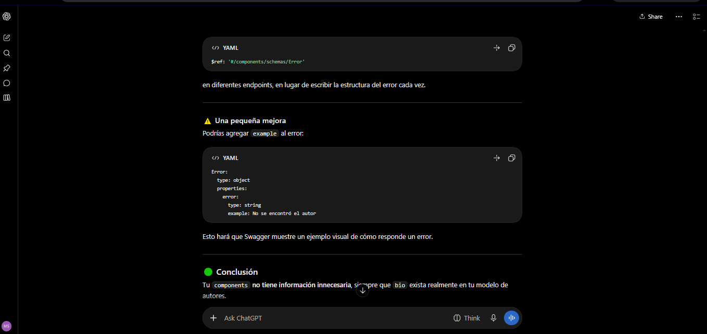

La respuesta de la IA brindó una sugerencia que permitió la mejora de la documentación y agregar mensajes como ejemplos.

## Prompt:
Cómo puedo pasar las validaciones actuales ya definidas a funciones?

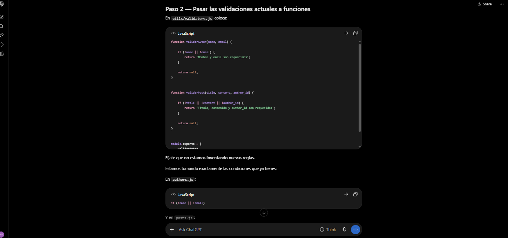
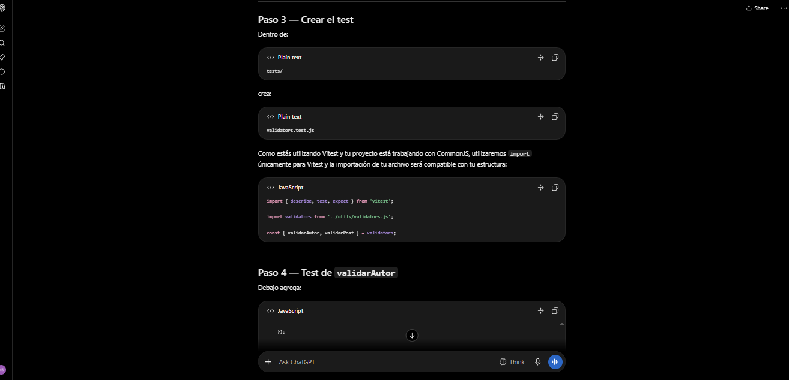
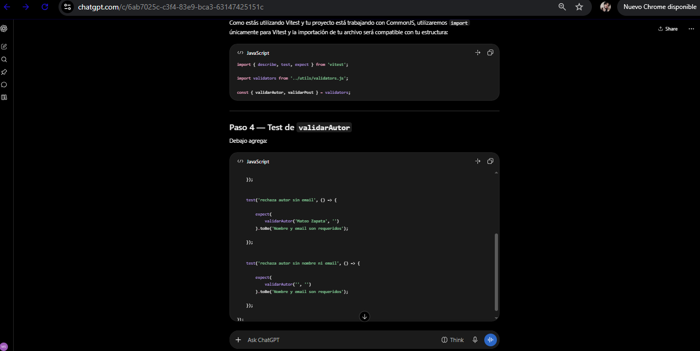

Durante la modularización del código la respuesta de la IA ayudó a saber como pasar las validaciones actuales que ya funcionaban a funciones y dentro de qué archivo js se debían realizar.

## Prompt:
Al modularizar los códigos que manejan la lógica de la API, puedo borrar este código repetido sin que afecte su funcionamiento?

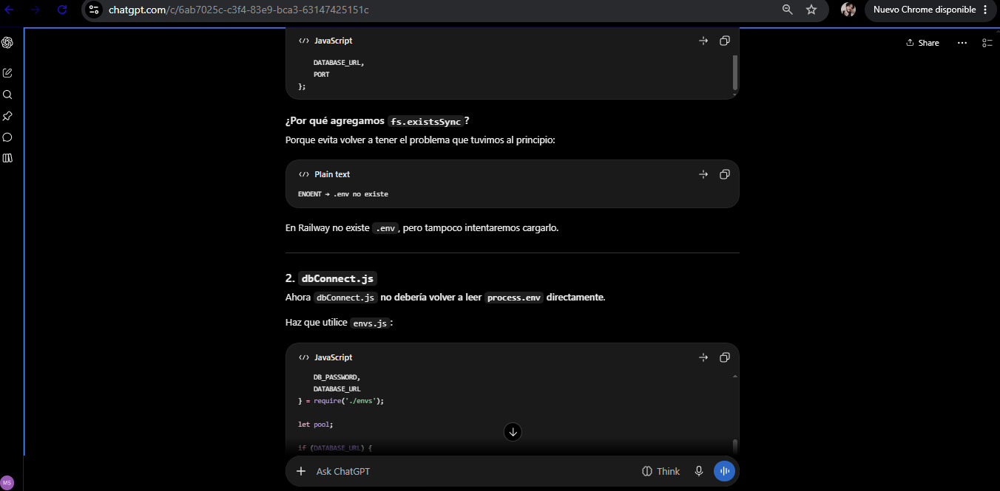
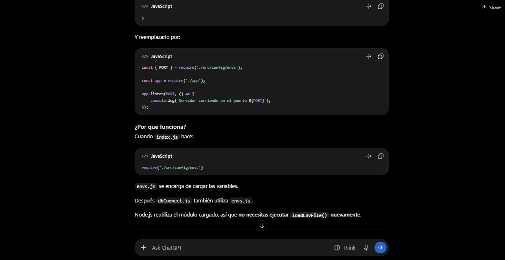
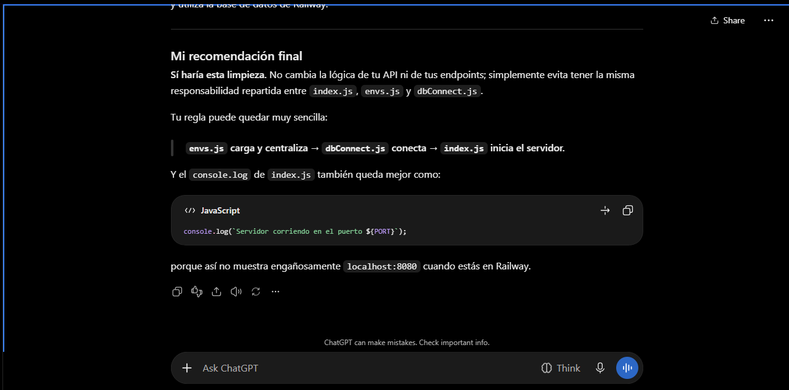

La respuesta de la IA ayudó a entender que al eliminar un código repetido que ya está siendo usado dentro de otro archivo JS no rompería nada del proyecto y más bien fue recomendable hacerlo.

## Prompt:
Describir funcionamiento de la arquitectura actual del proyecto.

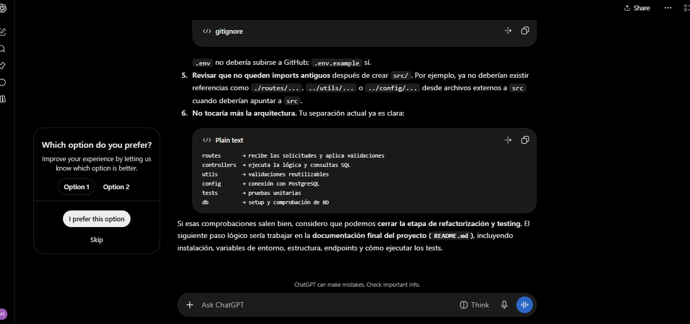
  
La respuesta de la IA ayudó a comprender que ya no se necesitaría más modificación en la estructura actual y brindó una retroalimentación sobre el funcionamiento actual.

## Prompt:
Consultar el funcionamiento de module.exports

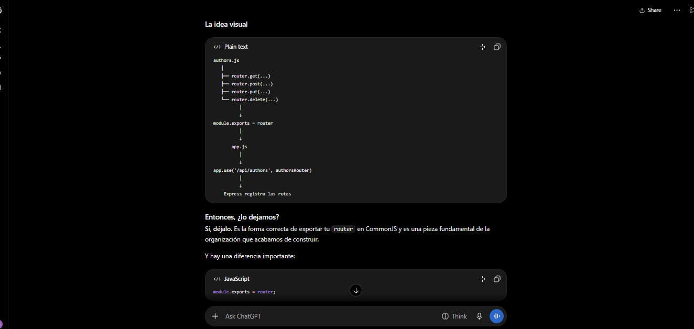
  
La respuesta de la IA ayudó a comprender de mejor manera la forma correcta de exportar el router dentro del proyecto

