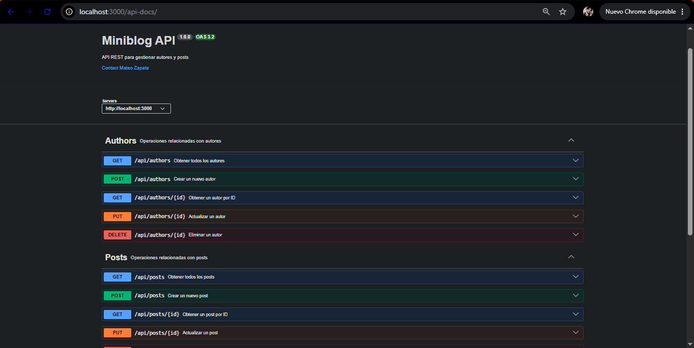
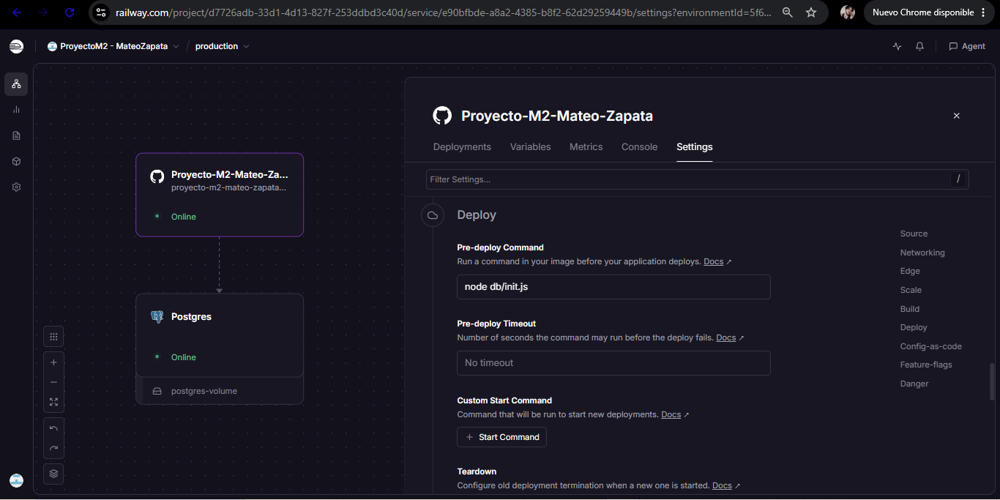
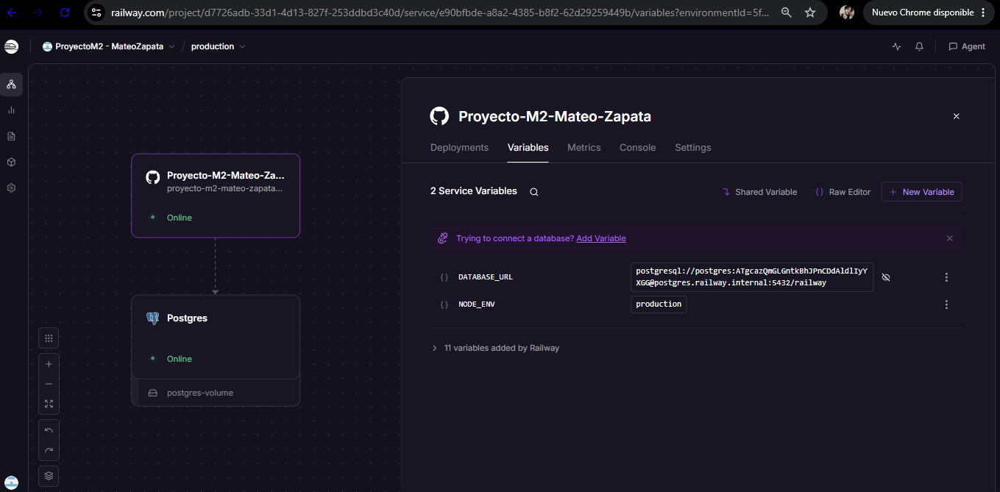
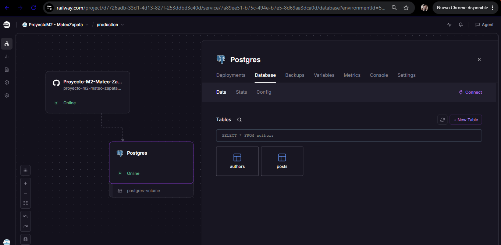

# 🚀 MiniBlog API - DevSpark 🌠
API REST desarrollada con Node.js, Express y PostgreSQL para gestionar autores (authors) y publicaciones (posts) con una relación que indica que un autor tiene muchos posts dentro de un MiniBlog.

El proyecto implementa operaciones CRUD para autores y posts, validación de datos, manejo de errores, persistencia en PostgreSQL y documentación interactiva mediante Swagger/OpenAPI.

La API se encuentra desplegada en Railway y también puede ejecutarse de forma local.

## 🔗 Enlaces del proyecto

| Recurso | Enlace |
|---|---|
| 🌐 API en producción (Railway) | https://proyecto-m2-mateo-zapata-production.up.railway.app |
| 📖 Swagger UI (producción) | https://proyecto-m2-mateo-zapata-production.up.railway.app/api-docs |
| 📄 Especificación OpenAPI | [openapi.yaml](./openapi.yaml) |
| 💻 Repositorio | https://github.com/Mattzap97/Proyecto-M2-Mateo-Zapata |


## 🛠️ Tecnologías utilizadas

- Node.js
- Express
- PostgreSQL
- JavaScript
- Vitest
- Supertest
- Swagger / OpenAPI
- Railway


## ✨ Funcionalidades 

- CRUD completo de autores.
- CRUD completo de posts.
- Consulta de posts filtrados por estado de publicación, ya sea (true o false)
- Consulta de posts relacionados con un autor.
- Validación de datos de entrada.
- Validación de IDs.
- Manejo de errores HTTP y errores de PostgreSQL.
- Persistencia de información en PostgreSQL.
- Tests unitarios con Vitest.
- Documentación interactiva de la API con Swagger.
- Despliegue en Railway.


## 📁 Estructura del proyecto


```text
Proyecto-M2-Mateo-Zapata/
├── src/
│   ├── config/
│   │   ├── dbConnect.js              # Configura la conexión con PostgreSQL
│   │   └── envs.js                   # Carga y gestiona las variables de entorno
│   │
│   ├── controllers/
│   │   ├── authorsController.js      # Gestiona la lógica de los endpoints de autores
│   │   └── postsController.js        # Gestiona la lógica de los endpoints de posts
│   │
│   ├── routes/
│   │   ├── authors.js                # Define las rutas CRUD de autores
│   │   └── posts.js                  # Define las rutas CRUD de posts
│   │
│   └── utils/
│       └── validators.js             # Contiene las validaciones de datos de la API
│
├── db/
│   ├── setup.sql                     # Crea las tablas y relaciones de la base de datos
│   ├── seed.sql                      # Inserta datos iniciales de ejemplo
│   ├── init.js                       # Inicializa automáticamente la base de datos
│   └── test-connection.js            # Comprueba la conexión con PostgreSQL
│
├── tests/
│   └── validators.test.js            # Pruebas unitarias de las funciones de validación
│
├── app.js                            # Configura Express, rutas, Swagger y manejo de errores
├── index.js                          # Inicia el servidor y escucha en el puerto configurado
├── openapi.yaml                      # Documentación de la API mediante OpenAPI/Swagger
├── package.json                      # Configuración del proyecto y dependencias
├── .env.example                      # Ejemplo de las variables de entorno necesarias
└── README.md                         # Documentación general del proyecto
```

## 🚀 Instalación

### 1. Clonar el repositorio

```
</> Bash

git clone https://github.com/Mattzap97/Proyecto-M2-Mateo-Zapata.git
cd proyecto-m2-mateo-zapata
```

### 2. Instalar dependencias

```
</> Bash

npm install
````

## 3. Configurar las variables de entorno (.env)

Crear un archivo `.env` en la raíz del proyecto tomando como referencia `.env.example`.

Ejemplo:

```env
DB_HOST=localhost
DB_PORT=5432
DB_NAME=miniblog
DB_USER=postgres
DB_PASSWORD=tu_contraseña
PORT=3000
```
Las variables de conexión corresponden a la configuración de PostgreSQL utilizada en el entorno local.

### ¿Qué significa cada variable?

- `DB_HOST`: dirección donde está funcionando PostgreSQL. En un entorno local normalmente es localhost.
- `DB_PORT`: puerto utilizado por PostgreSQL. El valor habitual es 5432.
- `DB_NAME`: nombre de la base de datos creada para el proyecto. Por ejemplo, miniblog.
- `DB_USER`: usuario utilizado para conectarse a PostgreSQL. Por ejemplo, postgres.
- `DB_PASSWORD`: contraseña del usuario de PostgreSQL.
- `PORT`: puerto donde se ejecutará la API. Por ejemplo, 3000.

⚠️ Los valores mostrados solo son ejemplos. Deben reemplazarse por los datos de configuración de cada entorno.


## 🗄️ Base de datos

Esta sección es importante porque tienes `setup.sql`, `seed.sql` e `init.js`.
El proyecto utiliza PostgreSQL como sistema de gestión de base de datos.

### Estructura

La base de datos está compuesta por dos tablas principales:

- `authors`: almacena la información de los autores.
- `posts`: almacena las publicaciones y su relación con los autores.

La relación entre ambas tablas se establece mediante `author_id` en `posts`.

### Archivos SQL

- `setup.sql`: crea las tablas y establece sus relaciones.
- `seed.sql`: contiene datos de ejemplo para authors y posts.
- `init.js`: inicializa la base de datos automáticamente en el entorno desplegado.

La tabla `posts` utiliza una clave foránea hacia `authors` y tiene configurado `ON DELETE CASCADE`.


## ▶️ Ejecución

### Entorno de desarrollo

Para ejecutar el servidor en modo desarrollo:

```
</> Bash

npm run dev
```


### Entorno de producción

Para ejecutar la aplicación:

```
</> Bash

npm start
```

El servidor estará disponible en `http://localhost:3000`


## 📡 Endpoints

Dentro de MiniBlog API encontrarás los siguientes endpoints definidos dentro de `Authors` y `Posts`

### 👤 Autores

| Método | Endpoint | Descripción |
|---|---|---|
| GET | `/api/authors` | Obtener todos los autores |
| GET | `/api/authors/:id` | Obtener un autor por ID |
| POST | `/api/authors` | Crear un autor |
| PUT | `/api/authors/:id` | Actualizar un autor |
| DELETE | `/api/authors/:id` | Eliminar un autor |

### 📝 Posts

| Método | Endpoint | Descripción |
|---|---|---|
| GET | `/api/posts` | Obtener todos los posts |
| GET | `/api/posts/:id` | Obtener un post por ID |
| GET | `/api/posts/author/:authorId` | Obtener posts de un autor |
| POST | `/api/posts` | Crear un post |
| PUT | `/api/posts/:id` | Actualizar un post |
| DELETE | `/api/posts/:id` | Eliminar un post |


### Filtrar posts por estado de publicación

El endpoint `GET /api/posts` permite utilizar el parámetro opcional `published`.

Ejemplos:

```
Text

GET /api/posts?published=true
```
Obtiene únicamente los posts publicados.

```
Text

GET /api/posts?published=false
```
Obtiene únicamente los posts no publicados.
En caso de no proporcionar el parámetro, se devolverán todos los posts.


## ✔ Validaciones

Este proyecto MiniBlog API cuenta con funciones de validación para controlar los datos recibidos antes de realizar operaciones sobre la base de datos.

- Los autores requieren `name` y `email`.
- Los posts requieren `title`, `content` y `author_id`.
- Los IDs deben ser números enteros positivos.
- El parámetro `published` solo acepta `true` o `false`.
- Se controla la existencia de autores relacionados con los posts.

### Códigos HTTP utilizados

| Código | Significado |
|---|---|
| 200 | Operación realizada correctamente |
| 201 | Recurso creado correctamente |
| 400 | Datos enviados incorrectamente |
| 404 | Recurso no encontrado |
| 409 | Conflicto, por ejemplo email duplicado |
| 500 | Error interno del servidor |


## 🧪 Tests

El proyecto utiliza **Vitest** para las pruebas y **Supertest** como dependencia para pruebas relacionadas con HTTP.

Actualmente se cuenta con pruebas unitarias para las funciones de validación.

Para ejecutar los tests:

```
Bash

npm test
```
Para ejecutar los tests automáticos del proyecto y generar un reporte específico sobre las líneas de código testeadas:

```
Bash

npm run test:coverage
```
El proyecto cuenta con 15 unit-testings para validar diferentes tipos de entrada


## 📖 Documentación de la API

MiniBlog API cuenta con documentación interactiva mediante **Swagger UI** basada en la especificación OpenAPI.



### Local

`http://localhost:3000/api-docs`

### Producción

`https://proyecto-m2-mateo-zapata-production.up.railway.app/api-docs`

Desde Swagger se pueden consultar y probar los diferentes endpoints de autores y posts.

## ☁️ Deploy en Railway

La aplicación está desplegada en Railway y utiliza PostgreSQL como base de datos en producción.

### 🌐 API

`https://proyecto-m2-mateo-zapata-production.up.railway.app`

### 💾 Swagger en producción
```
Text

https://proyecto-m2-mateo-zapata-production.up.railway.app/api-docs
```
### ⚙ Configuración
1. Crear los servicios Node.js y PostgreSQL en Railway.
2. En Variables del servicio Node.js agregar:

```
Text

DATABASE_URL=${{Postgres.DATABASE_URL}}
```
3. En Settings → Deploy → Pre-deploy Command configurar:

```
Bash

node db/init.js
```
`IMPORTANTE:` El comando debe configurarse en el servicio de la aplicación, no en PostgreSQL, y no como `Custom Start Command`.



4. Mantener el inicio de la aplicación mediante:

```
Bash

npm start
```
5. Verificar que `db/init.js`, `db/setup.sql` y `db/seed.sql` estén incluidos en el repositorio.


### 💻 Inicialización de la base de datos
`node db/init.js` ejecuta `setup.sql` para crear las tablas y `seed.sql` para cargar los datos iniciales. Si la base de datos ya está inicializada, no vuelve a insertar los datos.
      
### 🔏 Variables de entorno
En producción no se utiliza `.env`; la conexión se realiza mediante DATABASE_URL configurada en Railway.



RECUERDA que el archivo `.env` se utiliza únicamente para el entorno local y no debe subirse al repositorio.

### 📐 Comprobación
Después del deployment:
- Verificar que la aplicación esté Online.
- Comprobar que PostgreSQL contenga authors y posts.
- Probar la API y Swagger desde las URLs de producción.



## 👨‍💻 Autor

**Mateo Zapata**

Proyecto desarrollado como parte del programa de formación Full Stack Development de Henry.

- GitHub: https://github.com/Mattzap97
- LinkedIn: https://www.linkedin.com/in/mateo-alexis-zapata-8a4b761ab/


